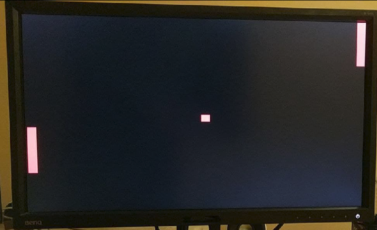

Pong game by Nandland
-----

### Objectives and considerations

* Test a simple video game with VGA output using a R2R VGA adapter attached

### Resources of information

* R2R VGA adapter (333)  https://www.waveshare.com/vga-ps2-board.htm
* Pong game https://www.nandland.com/goboard/pong-game-in-fpga-with-go-board-vga.html
* Original code https://github.com/nandland/nandland

### Development

All code from Nandland is top Pont_nandland.v and everything inside rtl folder.

From rtl folder UART_RX was not finally used, and instantiation from top file Pong_nandland.v was commented. This is the only part that did not work straight away.

Original target board Nandland has as 25 MHz clock. DECA has 50 MHz so I just needed to half it. No PLL was used.

Added the pin assignments to match the ones from DECA board, and corrected minor typos from original code.

### Control of the game

For start the game press both Key0 & Key1 buttons from DECA.  

Player 1 controls paddle with Key0 and  Key1 buttons.

Player 2 controls paddle with slides.

### Screen

### Circuit assembled

