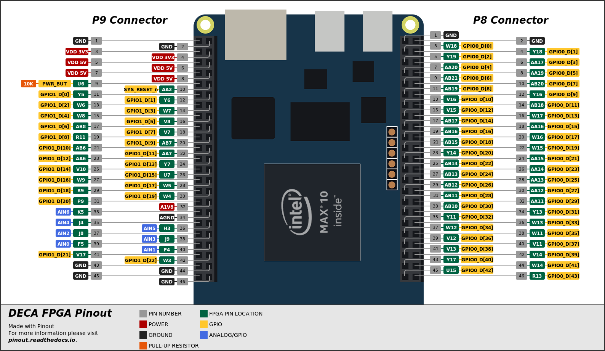

# DECA MAX 10 FPGA Pinout

## Single Line

## Offset Line

Made with [Pinout](https://github.com/j0ono0/pinout). For more information on *pinout* please visit [pinout.readthedocs.io](https://pinout.readthedocs.io/).
