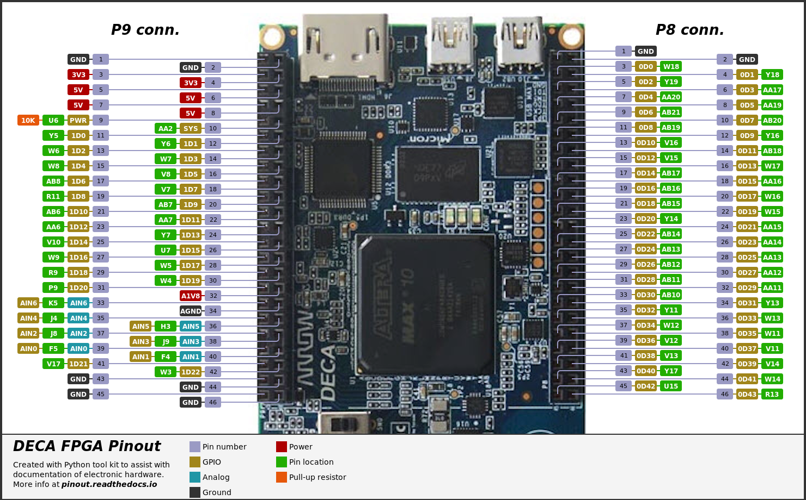
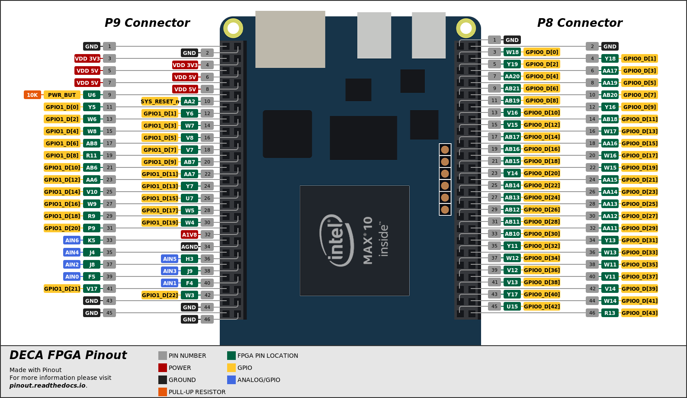

# DECA FGPA Pinout

Made with [Pinout](https://github.com/j0ono0/pinout). For more information on *pinout* please visit [pinout.readthedocs.io](https://pinout.readthedocs.io/).

## DECA-vectorized folder

## Single Line

## Offset Line

## Comments on double row connectors styling

Check this [Github issue](https://github.com/j0ono0/pinout/issues/41). 

