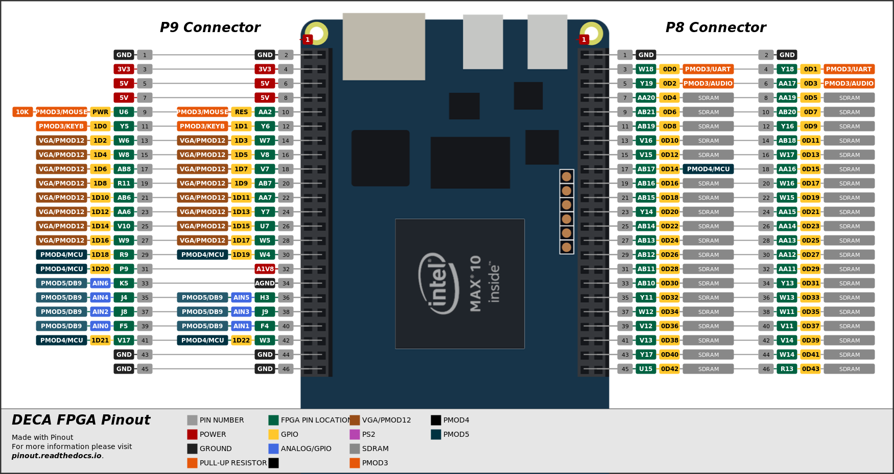
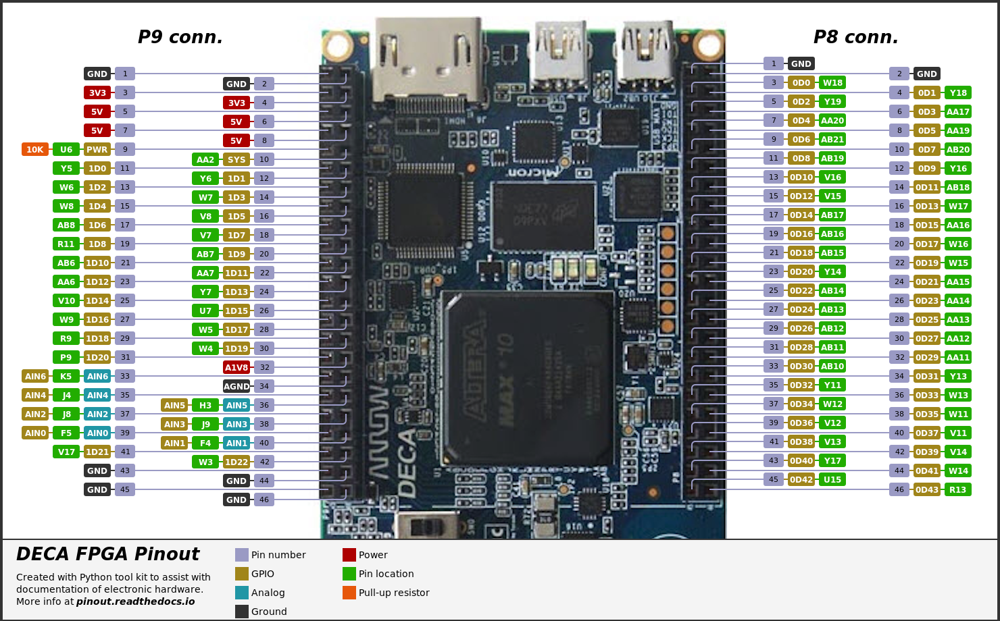

# DECA FGPA Pinout

Made with [Pinout](https://github.com/j0ono0/pinout). For more information on *pinout* please visit [pinout.readthedocs.io](https://pinout.readthedocs.io/).

For pinout comparison table with Neptuno, Unamiga, mc2, mc2+, ZXdos+, Atlas see this [spreadsheet.](Pinouts_FPGAs+Deca+ATLAS.ods)

## DECA-vector-Cores-v1.1 folder

## DECA-vector-Cape-v1 folder

Versions below were made with older versions of Pinout and need to be adapted if used with newer versions.

## DECA-bitmap folder

## DECA-vectorized folder

## Single Line

## Offset Line

## Comments on double row connectors styling

Check this [Github issue](https://github.com/j0ono0/pinout/issues/41). 

