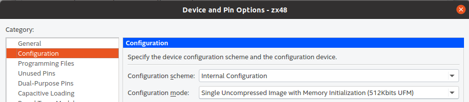

# DECA Development Kit

The DECA Development Kit presents a robust hardware design platform built around the Altera MAX 10 FPGA, which is the industry’s first single chip, non-volatile programmable logic devices (PLDs) to integrate the optimal set of system components. Users can now leverage the power of tremendous re-configurability paired with a high-performance, low-power FPGA system. Providing internally stored dual images with self-configuration, comprehensive design protection features, integrated ADCs and hardware to implement the Nios II 32-bit microcontroller IP, MAX10 devices are ideal solution for system management, I/O expansion, communication control planes, industrial, automotive and consumer applications. The DECA development board is equipped with high-speed DDR3 memory, video and audio capabilities, Ethernet networking, and much more that promise many exciting applications. 

The folders contain the following information:

* **Tutorials**: Porting cores tutorials and others
* **Documents**: Various useful documentation (schematics, images, ...)
* **Deca_pinout**:  Pinout of the Deca board Beaglebone Black connectors
* **Sdram_mister_deca**:  Hack to easily adapt a Mister SDRAM memory module to your Deca board
* **Litex**: Deca board target with Mister SDRAM for [Litex](https://github.com/enjoy-digital/litex) and Litex examples
* **FuseSoC**: Tutorial on FuseSoC with Deca board
* **Cores**: Sample cores 

## **Useful resources:**

* [DECA resources list](resources.md) 

* [Porting cores tutorial](./Tutorials/Porting-Cores)

* Buy at Arrow https://www.arrow.com/en/products/deca/arrow-development-tools

* Intel Community Knowledge Base -DECA https://community.intel.com/t5/FPGA-Wiki/DECA/ta-p/735458

* Examples of bare metal RiscV programming with softcore on a fpga https://github.com/infphyny/FpgaRiscV

  

## **Quartus configuration**

* Device: 10M50DAF484C6GES

* Device and Pin options > Configuration> Single Uncompressed image with Memory initialization (512 kbits UFM)  ([see notes](http://retroramblings.net/?p=1509))

  

### **Similar boards**

* DE10-Lite (MAX10 10M50DAF484C7G)

## Contact media

* [Telegram group](https://t.me/Deca_Max10_FPGA) 
* [Discord channel](https://discord.gg/YDdmtwh) 

