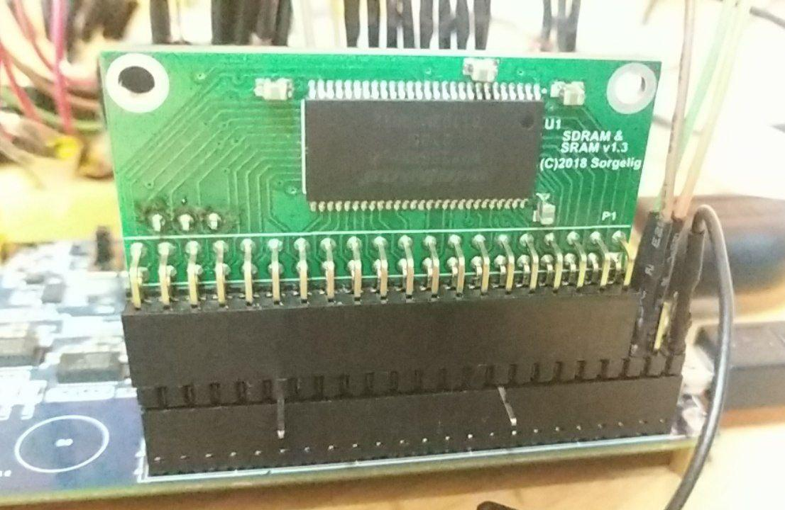

## SDRAM 3 pins Mister module testings with DECA

### Objectives and considerations

* Test convenience of using separate pins for CKE/DQML/DQMH instead of Mister modules using shared pins

### Binaries for testing

* [memtest_deca_3pins_211020.sof](https://github.com/DECAfpga/DECA_binaries/blob/main/Others/Memtest/old/memtest_deca_3pins_211020.sof)

* [nes_deca_3pins_sdram-mist_211029.sof](https://github.com/DECAfpga/DECA_binaries/blob/main/Consoles/NES_demistify/nes_deca_3pins_sdram-mist_211029.sof)

* [nes_deca_3pins_sdram-amr1_211029.sof](https://github.com/DECAfpga/DECA_binaries/blob/main/Consoles/NES_demistify/nes_deca_3pins_sdram-amr1_211029.sof)

* [nes_deca_3pins_sdram-amr2_211030.sof](https://github.com/DECAfpga/DECA_binaries/blob/main/Consoles/NES_demistify/nes_deca_3pins_sdram-amr2_211030.sof)

* [SDRAMStressTest_deca_0_XS.sof](https://github.com/DECAfpga/DECA_binaries/blob/main/Others/SDRAMStressTest/SDRAMStressTest_deca_0_XS.sof)

* [SDRAMStressTest_deca_1_3pins.sof](https://github.com/DECAfpga/DECA_binaries/blob/main/Others/SDRAMStressTest/SDRAMStressTest_deca_1_3pins.sof)

  

### Pictures of 3 pins Mister modules




### Modules tested with memtest

Tested with memtest_deca_3pins_211020.sof:

* "A2" dual memory: 

  * Start in auto mode and frecuency falls to 140 MHz.
  * Stable phase

    * T1) 55 minutes at 140 MHz.  Then falls to 100 MHz.  Test ended
    * T2) 33 minutes at 140 MHz.  Test ended
    * T3) 5 minutes at 140 MHz.  Test ended
    * T4) In auto falls to 80 MHz.  Test ended
    * T5) 5 minutes at 140 MHz.  Test ended
    * T6) 25 minutes at 140 MHz.  Test ended
  * Result: 140 MHz 
  * Notes: 
    * This model has all the condensers doubled
    * CKE, DQMH/L pins have been connected with 23 cm duponts
* "O1" dual memory:  
  * Start in auto mode and frecuency falls to 120 MHz.
  * Stable phase
    * T1) 10 minutes at 120 MHz. Test ended.
    * T2) 8 minutes at 120 MHz. Falls to 110 MHz. Test ended.
    * T3) Manual mode 120 MHz:   15  minutes at 120 MHz (66 min @120MHz with 1 error)
    * T4) Manual mode 120 MHz:   14:02       22   minutes at 120 MHz 
  * Result: 120 MHz 
  * Notes: 
    * CKE, DQMH/L pins have been connected with 23 cm duponts
* "O3" dual memory (tested by Rhoderik):
  * Start in auto mode and frecuency falls to 130 MHz.
  * Stable phase
    * Some tests show that after some minutes falls to 120 MHz
    * Test 22 min at 120 MHz
  * Result: 120 MHz 
  * Notes: 
    * CKE, DQMH/L pins have been connected with long duponts
* XS 2.2 Mister module 32 MB
  * Start in auto mode and frecuency falls to 160 MHz.
  * many tests made and is always stable at 160 MHz


### Modules tested with SDRAMStressTest 

To show numeric results you should execute this script meanwhile the core is running:

```sh
git clone https://github.com/DECAfpga/SDRAMStressTest
cd SDRAMStressTest
git  submodule update --init --recursive 
/path/a/quartus/bin/quartus_stp -t jtagbridge.tcl
```

NOTE: Between different test is better to power cycle the board.

Tested with SDRAMStressTest_deca_1_3pins.sof:

* "A2" dual memory (140 MHz memtest)  

  *  Parameters: CL2, riskcontention 0, SDRAM_DQM_SHARED
    *  10 min test: lots and lots of errors
  *  Parameters: CL3, riskcontention 1
    *  10 min test: p0: 0, p1: 0, p2: **33**, p3:  **25**, p4:  **1** errors
  *  Parameters: CL3, riskcontention 0
    *  10 min test: p0: 0, p1: 0, p2: **13**, p3: **4**, p4: 0  errors
    *  10 min test: p0: 0, p1: 0, p2: **5**, p3: **2**, p4: 0  errors (6/11/21)
    *  10 min test: p0: 0, p1: 0, p2: **8**, p3: **1**, p4: 0  errors (6/11/21)
* "O1" dual memory (120 MHz memtest)  

  * Parameters: CL3, riskcontention 0
    * 28 min test: p0: **0**, p1: **0**, p2: **0**, p3:  **0**, p4:  **0** errors (6/11/21)
    * 12 min test: p0: **0**, p1: **0**, p2: **0**, p3:  **0**, p4:  **0** errors (6/11/21)

Tested with SDRAMStressTest_deca_0_XS.sof:

* XS 2.2 Mister module 32 MB  (160 MHz memtest)  

  * Parameters: CL2, riskcontention 0, SDRAM_DQM_SHARED

    * 10 min test: p0: 0, p1: 0, p2: **10**, p3: **16**, p4: 0 errors

      
    
    

### 3 pins connections 


### NES core tests

SDRAM testing with 3 Mister Modules:

* dual memory module A2,  3 pins, 140 MHz memtest
* dual memory module O1, 3 pins,  120 MHz memtest

* module xs 2.2, does not have DQM pins exposed and has a stable 160 MHz memtest


Note: slash / separates different tests


**NES 85 MHz clk, original mist controller  (nes_deca_3pins_sdram-mist_211029.sof)**

* Castlevania III (last) Works:
	* module A2,  3 pins, 140 MHz memtest
	* module O1, 3 pins,  120 MHz memtest
* Castlevania III (last)  Do not work:
	* module xs 2.2, 160 MHz memtest


**NES 85 MHz clk, AMR mist controller  v1 ( DQM to A12:11)  (nes_deca_3pins_sdram-amr1_211029.sof)**

* Castlevania III (last)  Do not work in all 3 modules:nes_deca_3pins_sdram-amr2_211030.sof
	* module A2,  3 pins, 140 MHz memtest = black screen /  white screen
	* module O1, 3 pins,  120 MHz memtest = white screen
	* module xs 2.2, 160 MHz memtest = black screen

* Battletoads (U) Do not work very well
	* module A2,  3 pins, 140 MHz memtest = some glitches but better than previous test with O1 / intro works well in a loop
	* module O1, 3 pins,  120 MHz memtest = loads, but game is slow and sound crap / intro halted
	* module xs 2.2, 160 MHz memtest = intro of game halts at some point

* Batman (U) Works  in all three modules


**NES 85 MHz clk, AMR mist controller  v2 ( DQM to A12:11)  (nes_deca_3pins_sdram-amr2_211030.sof)**

* Castlevania III (last)  :
  * module A2,  3 pins, 140 MHz memtest = black screen / black screen with glitches
  * module O1, 3 pins,  120 MHz memtest = 
  * module xs 2.2, 160 MHz memtest = lots of glitches and brown/green screen

* Battletoads (U) 
  * module A2,  3 pins, 140 MHz memtest = some glitches but playable / intro works well in a loop
  * module O1, 3 pins,  120 MHz memtest =  
  * module xs 2.2, 160 MHz memtest = intro repeats in a loop and playable


**Preliminar conclusion** (more consitent and repetitive testing is needed)

* Works better with original SDRAM mist controller without adapting DQM to A12:11
* Works better with the 3 pins modules

