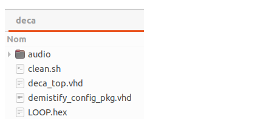

## Some notes about DeMiSTifyng a MiST core

[DeMiSTify](https://github.com/robinsonb5/DeMiSTify)  is support code intended to assist in the porting of MiST FPGA cores to other target boards (Copyright (c) 2021 by Alastair M. Robinson).

Follows a brief guide on how to use it ( comments from Alastair M. Robinson indicated as AMR ):

* Clone the target Mist core to be ported to DECA or any other board supported (in the following tutorial where you see deca replace it with your own board name). In this tutorial we are porting NES core.

* Add DeMiSTify to project as a submodule:
   `git submodule add git@github.com:DECAfpga/DeMiSTify.git `

  url will soon be changed to main DeMiSTify Alastair repository when it's merged

* Get a recent DeMiSTifyed core (In this tutorial we are taking the Oric core) and check the following objects are in your new core. You can copy missing files or get them from templates folder (DeMiSTify/templates)


* Makefile: Edit Makefile and change the name of the project. The rest should be fine.

* Oric.qip: Change filename of Oric.qip to deca.qip and fill in with the original files from Mist core (found in .qsf) respecting the format of Oric.qip.  

  * Don't include the pll file, as it will be included in top.qip at deca folder.
  * Leave the original constraint file, but it will need to be edited as commented below

* project_files.rtl is a bit like a .qip file but not quartus-specific.  

* project_defs.tcl  edit and check settings like project and requires_sdram

* build_id.mk

  * AMR: isn't needed for the some cores.  If it's needed, there'll be a TCL script with the MiST core which generates the build_id.v file, so we just add that script so it gets run at the appropriate time.
  * AMR: The build_id.tcl is a pre-flow script which generates a build_id.v file - it just depends on what the mist core wants - most of them generate a version string which is included in the config string.  Some cores are not usign this so this file can be ignored.

* In deca folder just leave the following files:

  

* Board specific files: audio folder and LOOP.hex are deca specific board files to deal with I2S audio output. These files are defined in Board/deca/deca_support.tcl

* PLL: In deca folder you will need to add the pll files from the original Mist core but adapting the clock source from 27 MHz to 50 MHz (and optionally adapting it to the Altera family).

  * AMR: What I usually do is open the MiST project, and have a look at the PLL, then create a new one for the target board, with the same output frequencies, but the appropriate input frequency.  
  * AMR: the Clock27 input on the MiST core that we're wrapping - it's not 27MHz, it's whatever clock the board provides.  It'd just be too much of a pain to rename it.

* top.qip: Create a new file named "top.qip" and include project specific files like deca_top.vhd and PLLs. 

  * AMR: "I normally have a root .qip which has all the project files and the project constraints file.  Then in each board directory I have top.qip which references the toplevel file for that board, and also any PLLs needed for the project - and if there's anything else needed, like some defines, they can be added too."  

* demistify_config_pkg.vhd  can be included in project_files.rtl 

* deca_top.vhd is a wrapper for the original Mist core.  

  * Edit it and change the guest module name.
  * AMR: deca_top.vhd will probably be nearly identical to the one for the Mist core - it just has to deal with the name of the Mist core changing from core to core, and other subtleties like whether or not Clock27 is defined with one input or two (annoyingly that varies from core to core!).

* If needed to adapt anything, adjustments to board definition can be found inside the DeMiSTify/Board/xxxx folder

* From the original Mist core it may be needed to adapt just few things, e.g.:
  * To supply audio samples for I2S sound you would need to get out the DAC inputs from Mist top to the deca top.
  * constraints file: remove the generic Mist board references that are replaced in the boards target specific constraint file (e.g. DeMiSTify/Board/deca/constraints.sdc)
    * AMR: It'll need adapting - usually it's just a case of removing the MiST names for signals and replacing them with the variables defined in the board-specific constraints files.
  
* Compile the project:

```sh
#submodules will be downloaded, including DeMiSTify if you added it in the .gitmodules
git submodule update --init --recursive
#following is not going to be needed when dev branch is merged with main 
cd DeMiSTify
git checkout dev
#edit file site.mk and add your own PATHs to Quartus
gedit site.mk
git add .
#go back to root folder and do a make with board target (deca, sidi, neptuno, ...)
cd ..
make BOARD=deca init
```

* When you do "make BOARDS=deca init" the scripts will generate a new quartus project file in deca/ pulling together the files in project_files.rtl, the stuff in DeMistify/Boards/deca and the deca/top.qip file.
* "make BOARDS=deca" will create the project files and then compile them.  If you want to just create the project so you can open it in Quartus, then use make BOARDS=deca init
* "make" will do make init, followed by make compile for all boards defined in the makefile.
* makefile recognizes commands "init" "compile" "firmware" and "firmware_clean". If you don't supply a command it does everything.
* When if finishes you will have the ported core inside the deca folder. Without init you will find the bitstream in output_files folder also.


## Troubleshooting

* Problems loading initial ROM file:    You may have to override a function in firmware/overrides.c to make sure the io index is correct, adding the line    `const char *bootrom_name="SVI328  ROM";`  to firmware/overrides.c  ( note the filename must be in 8/3 format with no dot).


## Notes about Constraint files

* It's ok to have two constraint files in the core, one project specific and one board specific
  * AMR: the board-specific one does things like "set RAM_OUT {DRAM_DQ* DRAM_ADDR* DRAM_BA* DRAM_RAS_N DRAM_CAS_N DRAM_WEN DRAM*DQM DRAM_CS_N DRAM_CKE}".  The SPI clock is defined in the board constraints too.
  * AMR: the project one does things like "set_output_delay -clock [get_clocks $sdram_clk] -reference_pin [get_ports ${RAM_CLK}] -max 1.5 [get_ports ${RAM_OUT}]"
  * AMR: It avoids having to write the whole constraints file for every board, every time you port a core.
  * AMR: What's nice is that variables defined in one .sdc file are visible from within subsequent .sdc files.
* The constraints file will need adapting.  Each board has its own constraints files which define things like the pin names for the RAM, which pins can be treated as false paths, etc.  That way a single project constraints file can be shared between targets.


