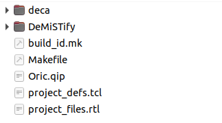

## Some notes about DeMiSTifyng a MiST core

[DeMiSTify](https://github.com/robinsonb5/DeMiSTify)  is support code intended to assist in the porting of MiST FPGA cores to other target boards (Copyright (c) 2021 by Alastair M. Robinson).

Follows a brief guide on how to use it (AMR indicates notes of the autor):

* Download a new Mist core to be ported to DECA or any other board supported (in the following lines where you see deca replace it with your own board name)
* Get another DeMiSTifyed core and copy the following objects  (** see note below)



**Note: to get the latest version of DeMiSTify don't copy the DeMiSTify folder but add the following into the .gitmodules file

```sh
[submodule "DeMiSTify"]
	path = DeMiSTify
	url = git@github.com:DECAfpga/DeMiSTify.git
#url will soon be changed to main DeMiSTify Alastair Repository when it's merged
```

* Change file name of Oric.qip to deca.qip and fill in with the original core files from Mist project (qsf) respecting the format of Oric.qip.  

  * Don't include the pll file, as it will be included in the deca folder.
  * Leave the original constraint file, but will be need to be edited as seen below

* Edit Makefile and change the name of the project.

* In deca folder just leave the following files:

  

* Replace pll.xxx with the Mist core pll, changing clock source from 27 MHz to 50 MHz (and optionally adapting it to the Altera family).

  * AMR: What I usually do is open the MiST project, and have a look at the PLL, then create a new one for the target board, with the same output frequencies, but the appropriate input frequency.  
  * AMR: the Clock27 input on the MiST core that we're wrapping - it's not 27MHz, it's whatever clock the board provides.  It'd just be too much of a pain to rename it.

* Create a new file named "top.qip" and include project specific files like deca_top.vhd and plls. 

  * AMR: "I normally have a root .qip which has all the project files and the project constraints file.  Then in each board directory I have top.qip which references the toplevel file for that board, and also any PLLs needed for the project - and if there's anything else needed, like some defines, they can be added too."

* deca_top.vhd is a wrapper for the original Mist core.  

  * Edit it and change the guest module name.
  * AMR: deca_top.vhd will probably be nearly identical to the one for the Oric core - it just has to deal with the name of the Mist core changing from core to core, and other subtleties like whether or not CLOCK27 is defined with one input or two.. (Annoyingly that varies from core to core!)

* If needed to adapt anything, adjustments to board definition can be found inside the DeMiSTify/Board/xxxx folder

* From the original Mist core it may be needed to adapt just few things, e.g.:
  * To supply audio samples for I2S sound you would need to get out the DAC inputs from Mist top to the deca top.
  * constraints file: remove the generic Mist board references that are replaced in the boards target specific constraint file (e.g. DeMiSTify/Board/deca/constraints.sdc)
    * AMR: It'll need adapting - usually it's just a case of removing the MiST names for signals and replacing them with the variables defined in the board-specific constraints files.
  
* Compile the project:

```sh
#in the root folder of project (where you copied the makefile)
make
#submodules will be downloaded, including DeMiSTify if you added it in the .gitmodules
cd DeMiSTify
#following is not going to be needed when dev branch is merged with main 
git checkout dev
#edit file site.mk and add your own PATHs to Quartus
gedit site.mk
#go back to root folder and do a make with board target (deca, sidi, neptuno, ...)
cd ..
make BOARD=deca init
```

* When you do "make BOARDS=deca init" the scripts will generate a new quartus project file in deca/ pulling together the files in project_files.rtl, the stuff in DeMistify/Boards/deca and the deca/top.qip file.
* And "make" will do make init, followed by make compile for all boards defined in the makefile.
* When if finishes you will have the ported core inside the deca folder including the bitstream in output_files folder


## Troubleshooting

* Problems loading initial ROM file:    You may have to override a function in firmware/overrides.c to make sure the io index is correct, adding the line    `const char *bootrom_name="SVI328  ROM";`  to firmware/overrides.c  ( note the filename must be in 8/3 format with no dot).


## Notes about Constraint files

* It's ok to have two constraint files in the core, one project specific and one board specific
  * AMR: the board-specific one does things like "set RAM_OUT {DRAM_DQ* DRAM_ADDR* DRAM_BA* DRAM_RAS_N DRAM_CAS_N DRAM_WEN DRAM*DQM DRAM_CS_N DRAM_CKE}".  The SPI clock is defined in the board constraints too.
  * AMR: the project one does things like "set_output_delay -clock [get_clocks $sdram_clk] -reference_pin [get_ports ${RAM_CLK}] -max 1.5 [get_ports ${RAM_OUT}]"
  * AMR: It avoids having to write the whole constraints file for every board, every time you port a core.
  * AMR: What's nice is that variables defined in one .sdc file are visible from within subsequent .sdc files.
* The constraints file will need adapting.  Each board has its own constraints files which define things like the pin names for the RAM, which pins can be treated as false paths, etc.  That way a single project constraints file can be shared between targets.


