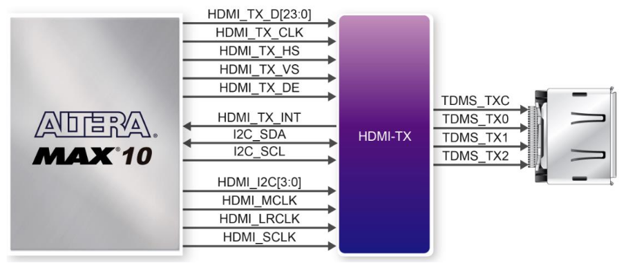

# Using DECA's HDMI TX

The development board provides High Performance HDMI Transmitter via the Analog Devices
ADV7513 which incorporates HDMI v1.4 features, including 3D video support, and 165 MHz
supports all video formats up to 1080p and UXGA. The ADV7513 is controlled via a serial I2C bus
interface, which is connected to pins on the MAX 10 FPGA. (extract from DECA user manual)

A schematic diagram of the HDMI TX circuitry is shown in next figure:  



See DECA User manual Table 3-14 for a list of HDMI Interface pin assignments and signal names relative to the MAX 10 device. 

### Resources

* [ADV7513_Datasheet.pdf](datasheets/ADV7513_Datasheet.pdf) 
* [ADV7513_Hardware_User's_Guide_R0.pdf](datasheets/ADV7513_Hardware_User's_Guide_R0.pdf) 
* [ADV7513_Programming_Guide_RB.pdf](datasheets/ADV7513_Programming_Guide_RB.pdf) 

Others:

* For HDMI video only check this [commit.](https://github.com/SoCFPGA-learning/DECA/commit/92364bb4a4172e98cee600806a3487ae718511b1)
* HDMI examples from [Deca's Terasic Resource CD](https://www.terasic.com.tw/cgi-bin/page/archive.pl?Language=English&CategoryNo=&No=944&PartNo=4).
* ADV7513-Based Video Generators application note https://www.analog.com/media/en/technical-documentation/application-notes/AN-1270.pdf (Note: register script is full of typos. Don't trust it)
* Test for video output using the ADV7513 chip on a de10 nano board  https://github.com/nhasbun/de10nano_vgaHdmi_chip.  Includes programing and reference guide for ADV7513 chip.
* HDMI video (ADV7513) https://github.com/chriz2600/DreamcastHDMI/tree/develop/Core/source/adv7513

### Adapting cores to work with HDMI (Video & Audio)

The following implementation uses I2C communication.

The original code comes from "HDMI_TX" example from [Deca's Terasic Resource CD](https://www.terasic.com.tw/cgi-bin/page/archive.pl?Language=English&CategoryNo=&No=944&PartNo=4).


**Add following files to a folder named "rtl_deca/hdmi" inside Quartus project folder**

* [I2C_HDMI_Config.v](../rtl_deca/hdmi/I2C_HDMI_Config.v) Send configuration parameters to the ADV7513 chip through I2C

* [I2C_Controller.v](../rtl_deca/hdmi/I2C_Controller.v) I2C protocol controller

  

**Modify QSF file**

* Add Verilog files:

```
set_global_assignment -name VERILOG_FILE rtl_deca/hdmi/I2C_Controller.v
set_global_assignment -name VERILOG_FILE rtl_deca/hdmi/I2C_HDMI_Config.v
```

* Add additional PIN assignments for the HDMI. Check HDMI-TX section in this [template](https://github.com/SoCFPGA-learning/DECA/blob/main/Projects/zx48_hdmi/deca/zx48.qsf).

  

**Adapt Top project file**

(following excerpts are extracted from this [example](https://github.com/SoCFPGA-learning/DECA/blob/main/Projects/zx48_hdmi/deca/zx48.sv))

Add HDMI ports to top module:

```verilog
	// HDMI-TX  DECA 
	inout 		          		HDMI_I2C_SCL,
	inout 		          		HDMI_I2C_SDA,
	inout 		     [3:0]		HDMI_I2S,
	inout 		          		HDMI_LRCLK,
	inout 		          		HDMI_MCLK,
	inout 		          		HDMI_SCLK,
	output		          		HDMI_TX_CLK,
	output		    [23:0]		HDMI_TX_D,
	output		          		HDMI_TX_DE,    
	output		          		HDMI_TX_HS,
	input 		          		HDMI_TX_INT,
	output		          		HDMI_TX_VS,
```

In the module code add and adapt this code with your own "reset" signal and a 50 MHz clock (it might work with other frequencies), as well as all the related video signals:

```verilog
//  HDMI I2C CONFIG
I2C_HDMI_Config u_I2C_HDMI_Config (
	.iCLK(clock50),
    .iRST_N(reset_n),	// if reset_n is not high at bootup video will not be initialized. Try KEY0 button if having problems.
	.I2C_SCLK(HDMI_I2C_SCL),
	.I2C_SDAT(HDMI_I2C_SDA),
	.HDMI_TX_INT(HDMI_TX_INT)
	);

//  HDMI VIDEO
assign HDMI_TX_CLK = ~hdmi_pclk;
assign HDMI_TX_DE = ~blank;
assign HDMI_TX_HS = sync[0];
assign HDMI_TX_VS = sync[1];
assign HDMI_TX_D = rgb;

//  HDMI AUDIO
assign HDMI_MCLK = i2sMck;
assign HDMI_SCLK = i2sSck;
assign HDMI_LRCLK = i2sLr;
assign HDMI_I2S[0] = i2sD;

```


Note: When the original core has less than 8 bits per color then you can add zeros at the less significant bits or it is preferred to double the signal. So e.g. your core produces a 4 bit red signal to obtain a 8 bit signal just do `assign I_R = vga_r_s & vga_r_s`.


**HDMI Audio DAC**

For audio, signals i2sMck, i2sSck, i2sLr, i2sD should come from an I2S module from the original core. If the core has no I2S sound check the [Audio CODEC tutorial](https://github.com/SoCFPGA-learning/DECA/tree/main/Tutorials/Porting-Cores/AudioCODEC) to convert PWM audio to I2S audio.

For video, data enable signal (HDMI_TX_DE) might not be present in your core but should be easy to adapt:

* If you have the blank signal, try  `assign HDMI_TX_DE = ~blank;`  
* You could try also the following code  (not tested yet by myself):

```
assign oVGA_DE    = ((H_Cont >= (H_SYNC+H_BACK)) && (H_Cont < (H_SYNC+H_BACK+H_ACT))) && ((V_Cont >= (V_SYNC+V_BACK)) && (V_Cont < (V_SYNC+V_BACK+V_ACT))) ? 1'b1:1'b0;
```


