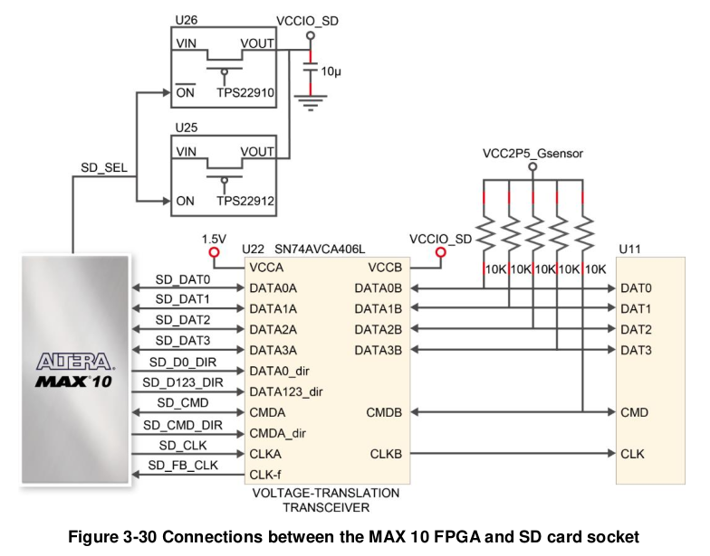

# Porting cores to DECA board

See below for target cores and porting from them.

### Audio through Line out 3.5 jack

Using DECA's integrated TLV320AIC3254 Audio DAC https://github.com/SoCFPGA-learning/DECA/tree/main/Tutorials/Porting-Cores/AudioCODEC

### Video & Audio through HDMI

Using DECA's HDMI TX https://github.com/SoCFPGA-learning/DECA/tree/main/Tutorials/Porting-Cores/HDMI

### Video using an VGA adapter

Using an VGA adapter (333)  https://www.waveshare.com/vga-ps2-board.htm

See [VGA conversion from 666 to 333](VGA333/README.md)

### SD card 

* Apart from the 4 SPI pins used in most cores to control SD card (miso, mosi, clk, cs), in Deca board you need to add extra pins in the .qsf file to deal with the control of the SD level shifter. [Check this template (MicroSD section). ](https://github.com/SoCFPGA-learning/DECA/blob/main/Projects/DECA_Neptuno_board_test/Deca/tld_test_placa_deca_neptuno.qsf)



See DECA user's manual point 3.4.16 Micro SD Card Socket


* In the top HDL file add those extra pins as ports of the top module:

```
  output	SD_SEL,
  output	SD_CMD_DIR,
  output	SD_D0_DIR,
  output	SD_D123_DIR,
```

* In the top module code add these assignments to use the SDcard as a normal SPI SD card:

```
  // MicroSD Card 
  assign SD_SEL = 1'b0;   //0 = 3.3V at sdcard		
  assign SD_CMD_DIR = 1'b1;  // MOSI FPGA output	
  assign SD_D0_DIR = 1'b0;   // MISO FPGA input	
  assign SD_D123_DIR = 1'b1; // CS FPGA output	
  // 
```


### SDRAM

* Using 3.3V power supply from DECA, do not define GPIO pins as 3.3V.  Works best with Quartus 17.1 defaults: 2.5 V, 12 mA
  * Use Fast registers used in memtest example (see [qsf file](https://github.com/SoCFPGA-learning/DECA/raw/main/Projects/MemTest_Mister/synth/DECA/memtest_deca.qsf))
  
* If you use and external power supply for 3V3 then SDRAM pins can be  defined as 3V3 and speed problems seems to vanish.

* DQML/DQMH not connected on SDRAM XS 2.2/2.4 modules, so any controller making use of them will not work. 
  * Those pins are physically connected like this:    assign {SDRAM_DQMH,SDRAM_DQML} = SDRAM_A[12:11];
  
* SDRAM controller: [This controller](https://github.com/DECAfpga/NES/blob/main/deca/sdram.sv) is proven to work with Mister SDRAM 32 Mb XS v2.2 modules.

  

## Tips

* Always take care with the Reset signals of the cores. They tend to ruin your life and you won't find the culprit of why core is not working.
  * I assigned a reset signal to HDMI config initalization, but that signal was active at bootup until the first load of a ROM. I changed that signal for a button reset instead.
  * Take care of assigning pin locations to buttons you don't know yet what they are doing.  They could be doing a permanent reset and you would become crazy trying to understand why the core is not working.
* Don't use a direct clock for signals. Someone recommended me to use always PLL clocks. 
* Usually is not needed, but a good practice is to regenerate all IPs for the Max10 family

  * IP ALTDDIO_OUT  does not work in Max10 family. Change it for "Altera GPIO Lite IP Core". Direct instantiation of the ALTDDIO_OUT primitive does not seem to work reliably on the chosen FPGA and/or tool chain (MAX 10). The solution is to generate an IP core with the MegaWizard GPIO Lite Intel FPGA IP using a DDR register output.

* Don't you find that module being instantiated?  That's because some gracious mind put a different name for the filename than from the module.  In Linux it's easy to search for a module or signal name opening a terminal in the project code folder:

  ```sh
  grep -Rl "module_name" ./
  ```

  

## Target cores

* [Neptuno FPGA](https://github.com/neptuno-fpga/) 

* [Multicore2+](https://gitlab.com/victor.trucco/Multicore_Bitstreams) 

* DE10-Lite

* Mist

* Mister

  

## Porting from Neptuno FPGA

Porting from [Neptuno FPGA](https://github.com/neptuno-fpga/) platform is pretty easy with an VGA addon:

* Change FPGA target to Arrow DECA Max10
* Adapt FPGA pinout in .qsf file ([check this template)](https://github.com/SoCFPGA-learning/DECA/blob/main/Projects/DECA_Neptuno_board_test/Deca/tld_test_placa_deca_neptuno.qsf)
* No need to adapt clocks
* Adapt Video & Audio  (see above)
* Most cores use 32 MB SDRAM of the same kind of memory used by Mister modules ([see hack to connect it to DECA board)](https://github.com/SoCFPGA-learning/DECA/tree/main/Projects/sdram_mister_deca)
* Add pins to control SD card level shifter (see above)


