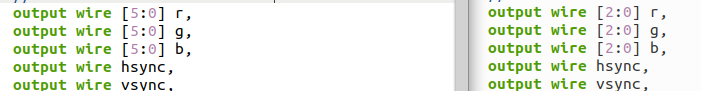
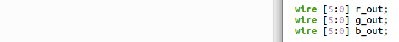
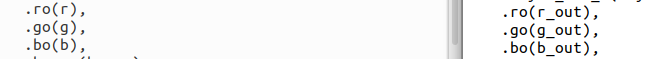
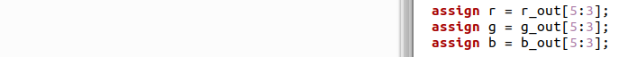

# VGA conversion from 666 to 333

See following example and adapt it to your own situation. Left is orignal core. Right is Deca's ported core.

port definition:

internal wires:

vga instantiated module:

wire assignment:

